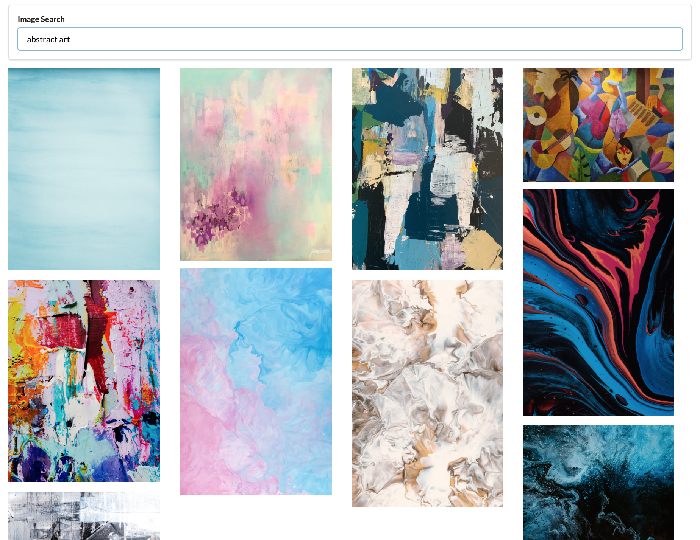

# [Live App Link](https://image-searcher.vercel.app)

React app to search images using Unsplash API.

## Tools Used

- react-js [[Ref]](https://reactjs.org/docs/getting-started.html)
- Unsplash API [[Ref]](https://unsplash.com/documentation#getting-started)
- Semantics UI (_for CSS_) [[Ref]](https://semantic-ui.com/introduction/getting-started.html)

## Running the project

In the project directory, you can run:

### `npm start`

Runs the app in the development mode. 
Open [http://localhost:3000](http://localhost:3000) to view it in the browser.

The page will reload if you make edits. 
You will also see any lint errors in the console.

## Usage

1. Type any keyword in the input field
2. Press 'Enter' to search for the keyword using Unsplash API
3. Returned images are displayed below

#### Credits

Stephen Grider [Modern React with Redux](https://www.udemy.com/course/react-redux/)
